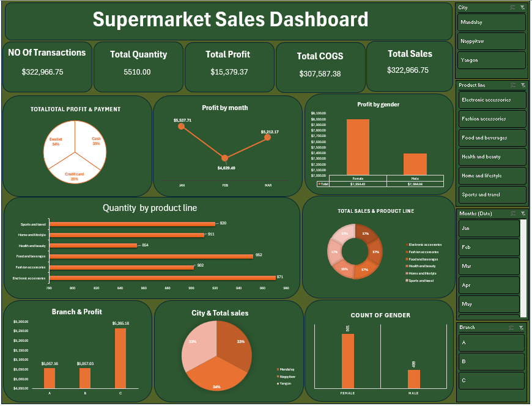

# Supermarket Sales Dashboard 🛒

Interactive Excel dashboard for analyzing sales performance, tracking KPIs, and generating insights.

### Key Features
* **KPIs:** Total Sales, Average Rating, and Volume.
* **Interactivity:** Slicers for City, Gender, and Product Line.
* **Analysis:** Sales trends and payment method distribution.

### Dashboard Preview

### How to Use
1. Download the Excel file from this repository.
2. Open it in Microsoft Excel to use the interactive slicers.
